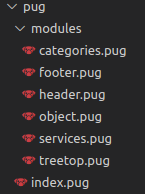
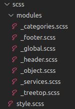

# [Webovio](https://dapper-crisp-a19bd4.netlify.app/)
A creative agency for redemptive brands. Anteelo is a leading strategic design firm that builds powerful digital solutions for startups and enterprises.
This Landing page features a drop-down navigation menu and minimalist animation.

<br>

<br>


The following technologies are used in the development of the landing:
markup and cascading style sheets. The library is also used  **jquery**.

Project navigation:

It uses Gulp and the pug and sass preprocessors.

If you need to start the development mode, you need to enter the command inside the downloaded projects in the terminal: 
 ```
 npm i 
 ```
This command will help you install the development package (*node_modules*).

## The main modules of the project and their dependencies. 

### **index** file uses pug files.
Hierarchy:
<br>

> 1. The file with the name **index** is initializing.
> 2. The files inside the modules folder are plug-ins  to a file named **index**.
> 3. The files inside the includes folder are plug-ins  to a file named **index**.


### The Scss folder.
Hierarchy:
<br>

> 1. The file named **style** is initializing.
> 2. The files inside the **modules** folder are plug-ins to a file called **style**.
> 3. The files inside the **includes, media** folder are plug-ins to a file called **style**.
> 4. The file called **style** also has **normalize** initialized.


